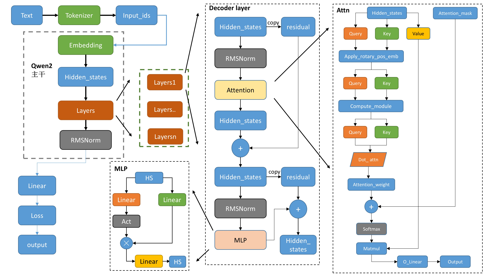

# Qwen-blog学习笔记

## Qwen2模型架构

图1 Qwen2模型架构图

Qwen2与Decoder-only的Llama2架构类似，都是由Tokenizer分词器、Embedding嵌入层以及由transformer decoder layer变体而来的decoder layer，不同的是Qwen2的decoder layer采用的是pre-norm，transformer的decoder layer采用的是post-norm，Qwen2的MLP层中加入了门控信息，Qwen2不只是在嵌入层添加位置信息，而是在每一个注意力层都使用了Qwen2RotaryEmbedding旋转嵌入，Qwen2使用RMSNorm正则化，transformer使用层正则化。

其中：

- `tokenizer`将文本转为词表里面的数值。
- 数值经过`embedding`得到一一对应的向量。
- post-norm 应对表征坍塌（Representation Collapse）的能力更强，但处理梯度消失略弱。而pre-norm可以更好的应对梯度消失，但处理表征坍塌的能力略弱。
- 旋转位置编码（Rotary Positional Embeddings, RoPE）替代了原有的绝对位置编码，从而增强位置编码的表达能力，增强了模型对序列顺序的理解。
- RMSNorm 是 LayerNorm 的简化版本，通过**移除中心化步骤**降低计算复杂度，同时在多数任务中保持性能接近。其核心优势是高效性，适合对计算资源敏感的大规模模型。
- 各类下游任务，`Casual`,`seqcls`等，基本都是基础模型`model`后面接对应的`Linear`层，还有损失函数不一样。

## 学习心得

学习 Qwen2 模型架构，让我对LLM的设计理念和技术细节有了更深入的认识。
Qwen2 与 Decoder - only 的 Llama2 架构有相似之处，都包含 Tokenizer 分词器、Embedding 嵌入层以及由 transformer decoder layer 变体而来的 decoder layer，这体现了在大语言模型架构设计中，一些核心组件具有共通性，它们是模型实现文本处理和理解的基础。
Qwen2 在设计上做了一些创新和改进，例如采用 pre-norm 结构来应对梯度消失问题，同时在 MLP 层中引入门控信息，这些设计使得模型在处理复杂任务时表现更佳。此外，Qwen2 使用了旋转位置编码（RoPE）来增强模型对序列顺序的理解能力，这一技术的应用展示了位置编码在大语言模型中的重要性。